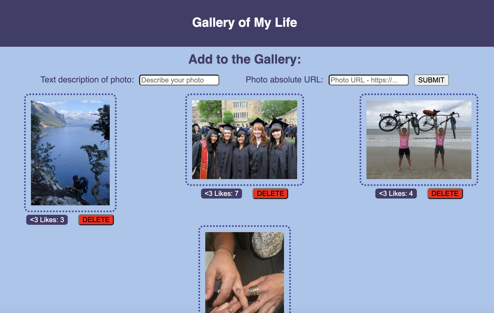
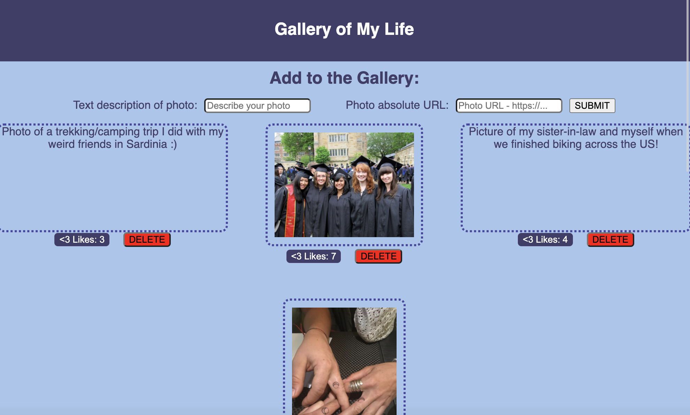

# Personalized Photo Gallery

## Description

_Duration: Approximately 15 hours_

This application serves as a Gallery that allows the user to:

- add photos via either a relative/absolute URL
- "like" a photo, with total "likes" accumulated and displayed beneath each photo.
- click on the image to toggle between displaying the image and the image description.
- delete photos from the gallery.

Here is a view of the gallery with a few personal photos saved to the database:

 A user may add photos by typing a description of the photo in the text box on the left, and input the URL of the image in the text box on the right.  Each time the "like" button is clicked beneath a photo, the likes accumulate and are stored in the database.  An item may be removed from the database altogether by clicking the 'DELETE' button underneath it.  To see the worded description of any given photo, the user simply needs to click on the photo.  To return to seeing the photo, the user will click on the worded description:

## Installation

1. Open this repository in your favorite code editor (VS Code was used for creating this app).
1. Install node and express (don't worry, I've already got a nifty .gitignore file to avoid committing and pushing the massive node_modules!) - simply run "npm install" in your terminal.
1. Create a database on your local server (Postico was used during creation).
   1. IMPORTANT: your database needs to be named react_gallery in order to communicate with the current code.
   1. Copy all of the text in the attached database.sql module and insert it into the SQL Query box of your react_gallery database.
   1. You can either execute this SQL statement as an entire block, or do them one by one from the top down (important that these are done sequentially in this case).
1. You will need multiple Terminal tabs open:
    1. Run "npm run server" in one to start the server - you should see "Listening on port: 5000" when the server is successfully running.
    1. Run "npm run client" in a second terminal.  You should see "Compiled successfully!" and your browser will automatically open the App.

## Usage

1. Choose a photo with a URL path.  Write a description of that photo in the text input box on the left, and insert the URL into the text input box on the right.
1. Click "Submit". Repeat these first two steps for each new photo you would like to add.
1. Upon submitting, your new photo will be added to the gallery.  The photo will initially be displayed; if you would like to see the written description for any photo, click on that photo.  To return to seeing the photo, click directly on the written description.
1. Click the "like" button below any photo for which you would like to show appreciation.  Total likes will be accumulated and saved in the database for each photo!
1. If you would like to completely remove a photo from the gallery (and the database), click the "DELETE" button underneath that photo.

## Built with:

- HTML
- CSS
- JavaScript
- React.js [JS framework]
- Node.js [Back-end JS run-time environment]
- Express [Back-end JS framework for Node.js]
- JSON [allow for transmission of data objects between Client and Server using human-readable text]
- PostgreSQL [relational database management]
- SQL [executing SQL statements to manage database]
- Postico [database app for executing SQL statements and running postgreSQL database tests]

## Acknowledgement

Thanks to [Prime Digital Academy](https://www.primeacademy.io/) who equipped and helped me to make this application a reality.
